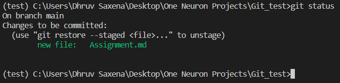

> git status: This `git status` command display the state of working directory and the staging area.

> git log: This `git log` command displays commited snapshorts. It let you list the project histroy, filter it, and search for specific changes.

> git add: The `git add` command adds a change in the working directory to the staging area.

>git commit: The `git commit` command captures a sanpshot of the project's currently staged changes.

> 