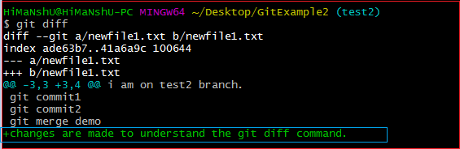

> 1. git status: This `git status` command display the state of working directory and the staging area.

> 2.  git log: This `git log` command displays commited snapshorts. It let you list the project histroy, filter it, and search for specific changes.

> 3. git add: The `git add` command adds a change in the working directory to the staging area.

> 4. git commit: The `git commit` command captures a sanpshot of the project's currently staged changes.

> 5. git branch: The `git branch` command lets you create, list, rename and delete branches.

> 6. git checkout: The `git checkout` command lets you navigate between the branches created by `git branch`.

> 7. git merge: The `git merge` command will combine multiple sequences of commit into one unified history. It is used to combine two branches.

> 8. git diff: The `git diff` command is a multi-use git command. When it is executed, it runs a diff function on git data sources. These data sources can be files, branches, commits, and more. It is used to show changes between commits, commit, and working tree, etc.

> 9. git push: The `git push` command is used to upload local repository content to remote repository. **git push <remote> <branch>**.

