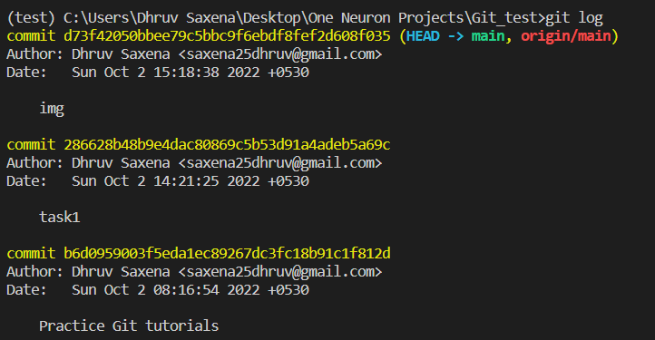
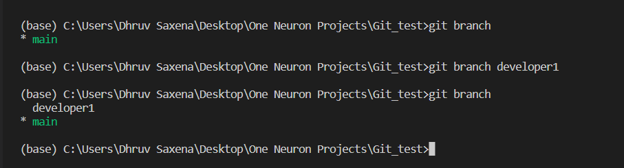

> 1. git status: This `git status` command display the state of working directory and the staging area.

> 2.  git log: This `git log` command displays commited snapshorts. It let you list the project histroy, filter it, and search for specific changes.

> 3. git add: The `git add` command adds a change in the working directory to the staging area.

> 4. git commit: The `git commit` command captures a sanpshot of the project's currently staged changes.

> 5. git branch: The `git branch` command lets you create, list, rename and delete branches.

> 6. git checkout: The `git checkout` command lets you navigate between the branches created by `git branch`.

> 7. git merge: The `git merge` command will combine multiple sequences of commit into one unified history. It is used to combine two branches.

> 8. git diff: The `git diff` command is a multi-use git command. When it is executed, it runs a diff function on git data sources. These data sources can be files, branches, commits, and more. It is used to show changes between commits, commit, and working tree, etc.

> 9. git push: The `git push` command is used to upload local repository content to remote repository. **git push (remote) (branch)**.

> 10. git pull: The `git pull` commad is used to fetch and download content from a remote repository and immediately update the local repository to match that content. It is a combination of `git fetch` and `git merge`.

> 11. git clone: The `git clone` command  is primarily used to point to an existing repo and make a clone or copy of that repo at in a new directory, at another location. 

> 12. git clean: The `git clean` command is to some extent an 'undo' command. Git clean can be considered complementary to other commands like git reset and git checkout.

> 13. git --version: The `git --version` command is for displaying the git version on your local machine.

> 14. git reset: The `git reset` command is used to unstage a file while retaining the changes in working directory.

> git init : The `git init` command is used to initialize an existing directory as a Git repository.

